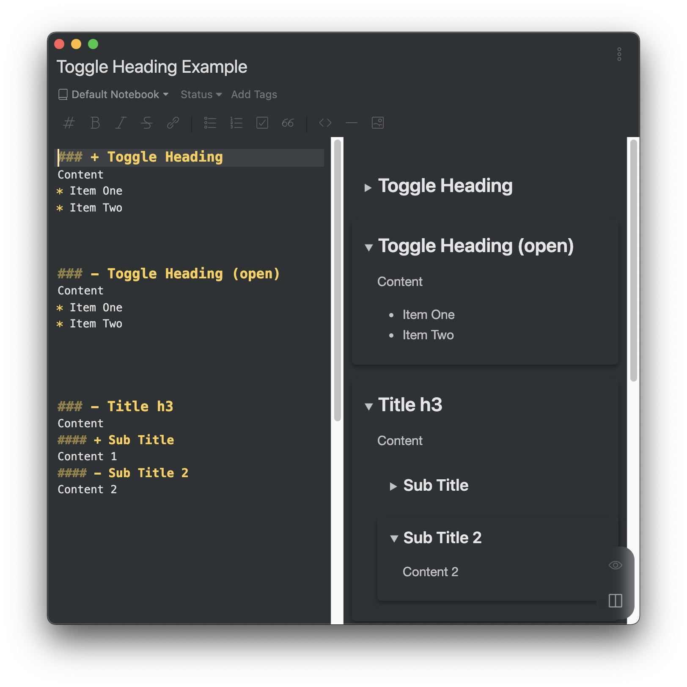

## Toggle Section

This plugin enables you to create toggle sections.

- Insert a prefix plus sign `+` in any section header to create a toggle section.

    ```markdown
    ### + Toggle Heading
    Content
    * Item One
    * Item Two
    ```

- You can insert a prefix minus sign `-` instead and the new toggle section is open.

    ```markdown
    ### - Toggle Heading (open)
    Content
    * Item One
    * Item Two
    ```

- Support multi-layer toggle sections

    ```markdown
    ### - Title h3
    Content
    #### + Sub Title
    Content 1
    #### - Sub Title 2
    Content 2
    ```



